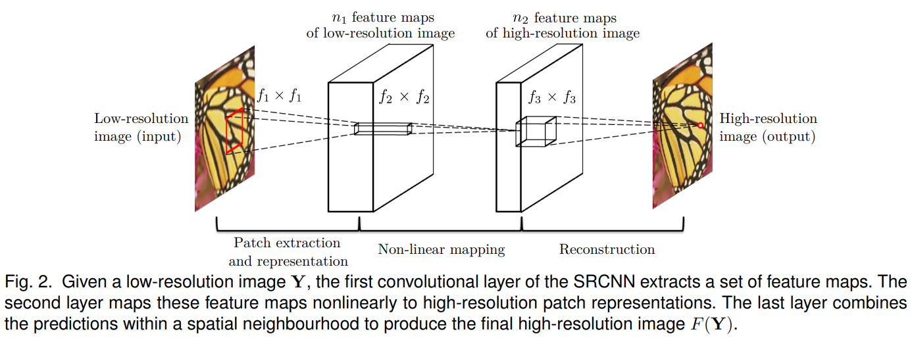
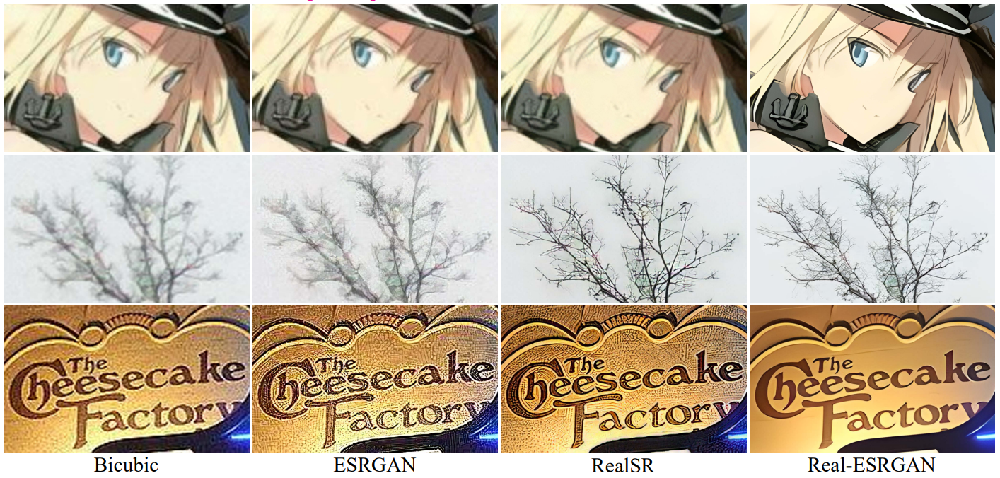

  
  

    <b>XPixel Homepage</b>
    
      <a href="http://xpixel.group/">
        <i>HOT</i>
      </a>
    
  

  
&nbsp;

English | [简体中文](README_zh-CN.md)

# Introduction

**X-Super-Resolution** is dedicated to presenting the research efforts of XPixel in the realm of image super-resolution. We are thrilled to share research papers and corresponding open-source code crafted by our team.

Super-resolution algorithms aim to reconstruct high-resolution images from low-resolution counterparts, preserving and enhancing important details.

  

Super-resolution has applications in various domains such as surveillance, medical imaging, satellite imagery, and digital entertainment. It enhances image and video quality, making it invaluable for tasks that require high levels of detail and accuracy. 

# Table of Contents

- [Representative Work](#representative)
  - [SRCNN](#srcnn)
  - [RealESRGAN](#realesrgan)
- [Blind SR](#blind-sr)
- [Classic SR](#classic-sr)

# Papers

## Representative Work:fire::fire::fire:

- Learning a Deep Convolutional Network for Image Super-Resolution 
  Chao Dong, Chen Change Loy, Kaiming He, Xiaoou Tang 
  Accepted at ECCV'14 
  :scroll:[`paper`](https://arxiv.org/abs/1501.00092) :house:[`project`](http://mmlab.ie.cuhk.edu.hk/projects/SRCNN.html) 
  

  
more

  We propose a deep learning method for single image super-resolution (SR). Our method directly learns an end-to-end mapping between the low/high-resolution images. The mapping is represented as a deep convolutional neural network (CNN) that takes the low-resolution image as the input and outputs the high-resolution one.

  

  
  

  

- Real-ESRGAN: Training Real-World Blind Super-Resolution with Pure Synthetic Data 
  Xintao Wang, Liangbin Xie, Chao Dong, Ying Shan 
  Accepted at ICCVW'21 
  :scroll:[`paper`](https://arxiv.org/abs/2107.10833) :computer:[`code`](https://github.com/xinntao/Real-ESRGAN) 
  

  
more

  In this work, we extend the powerful ESRGAN to a practical restoration application, which is trained with pure synthetic data. Specifically:
  
  1. A high-order degradation modeling process is introduced to better simulate complex real-world degradations.
  2. We also consider the common ringing and overshoot artifacts in the synthesis process.
  3. In addition, we employ a U-Net discriminator with spectral normalization to increase discriminator capability and stabilize the training dynamics.
  
  Extensive comparisons have shown its superior visual performance than prior works on various real datasets.

  

  
  

  

## Blind SR

- Blind Image Super-Resolution: A Survey and Beyond 
  Anran Liu, Yihao Liu, Jinjin Gu, Yu Qiao, Chao Dong 
  Accepted at TPAMI'22 
  :scroll:[`paper`](https://arxiv.org/abs/2107.03055)

- DeSRA: Detect and Delete the Artifacts of GAN-based Real-World Super-Resolution Models 
  Liangbin Xie, Xintao Wang, Xiangyu Chen, Gen Li, Ying Shan, Jiantao Zhou, Chao Dong 
  Accepted at ICML'23 
  :scroll:[`paper`](https://arxiv.org/abs/2307.02457) :computer:[`code`](https://github.com/TencentARC/DeSRA)

- Activating More Pixels in Image Super-Resolution Transformer 
  Xiangyu Chen, Xintao Wang, Jiantao Zhou, Yu Qiao, Chao Dong 
  Accepted at CVPR'23 
  :scroll:[`paper`](https://arxiv.org/abs/2205.04437) :computer:[`code`](https://github.com/chxy95/HAT)

- OSRT: Omnidirectional Image Super-Resolution with Distortion-aware Transformer 
  Fanghua Yu, Xintao Wang, Mingdeng Cao, Gen Li, Ying Shan, Chao Dong 
  Accepted at CVPR'23 
  :scroll:[`paper`](https://arxiv.org/abs/2302.03453) :computer:[`code`](https://github.com/Fanghua-Yu/OSRT)

- Metric Learning based Interactive Modulation for Real-World Super-Resolution 
  Chong Mou, Yanze Wu, Xintao Wang, Chao Dong, Jian Zhang, Ying Shan 
  Accepted at ECCV'22 
  :scroll:[`paper`](https://arxiv.org/abs/2205.05065) :computer:[`code`](https://github.com/TencentARC/MM-RealSR)

- A Closer Look at Blind Super-Resolution: Degradation Models, Baselines, and Performance Upper Bounds 
  Wenlong Zhang, Guangyuan Shi, Yihao Liu, Chao Dong, Xiao-Ming Wu 
  Accepted at CVPRW'22 
  :scroll:[`paper`](https://arxiv.org/abs/2205.04910) :computer:[`code`](https://github.com/WenlongZhang0517/CloserLookBlindSR)

- GCFSR: a Generative and Controllable Face Super Resolution Method Without Facial and GAN Priors 
  Jingwen He, Wu Shi, Kai Chen, Lean Fu, Chao Dong 
  Accepted at CVPR'22 
  :scroll:[`paper`](https://arxiv.org/abs/2203.07319)

- Reflash Dropout in Image Super-Resolution 
  Xiangtao Kong, Xina Liu, Jinjin Gu, Yu Qiao, Chao Dong 
  Accepted at CVPR'22 
  :scroll:[`paper`](https://arxiv.org/abs/2112.12089) :computer:[`code`](http://xpixel.group/None%20%20https://github.com/Xiangtaokong/Reflash-Dropout-in-Image-Super-Resolution)

- Finding Discriminative Filters for Specific Degradations in Blind Super-Resolution 
  Liangbin Xie, Xintao Wang, Chao Dong, Zhongang Qi, Ying Shan 
  Accepted at NIPS'21 (spotlight) 
  :scroll:[`paper`](https://arxiv.org/abs/2108.01070) :computer:[`code`](https://github.com/TencentARC/FAIG)

- RankSRGAN: Super Resolution Generative Adversarial Networks with Learning to Rank 
  Wenlong Zhang, Yihao Liu, Chao Dong, Yu Qiao 
  Accepted at TPAMI'21 
  :scroll:[`paper`](https://arxiv.org/abs/1908.06382) :computer:[`code`](https://github.com/WenlongZhang0724/RankSRGAN)

- Suppressing Model Overfitting for Image Super-Resolution Networks 
  Ruicheng Feng, Jinjin Gu, Yu Qiao, Chao Dong 
  Accepted at CVPRW'19 
  :scroll:[`paper`](https://arxiv.org/abs/1906.04809)

- Blind Super-Resolution With Iterative Kernel Correction 
  Jinjin Gu, Hannan Lu, Wangmeng Zuo, Chao Dong 
  Accepted at CVPR'19 
  :scroll:[`paper`](https://arxiv.org/abs/1904.03377)

- ESRGAN: Enhanced Super-Resolution Generative Adversarial Networks 
  Xintao Wang, Ke Yu, Shixiang Wu, Jinjin Gu, Yihao Liu, Chao Dong, Yu Qiao, Chen Change Loy 
  Accepted at ECCVW'18 
  :scroll:[`paper`](https://arxiv.org/abs/1809.00219) :computer:[`code`](https://github.com/xinntao/ESRGAN)

- Recovering Realistic Texture in Image Super-Resolution by Deep Spatial Feature Transform 
  Accepted at CVPR'18 
  Xintao Wang, Ke Yu, Chao Dong, Chen Change Loy 
  :scroll:[`paper`](https://arxiv.org/abs/1804.02815) :computer:[`code`](https://github.com/xinntao/SFTGAN)

- Unsupervised Image Super-Resolution Using Cycle-in-Cycle Generative Adversarial Networks 
  Yuan Yuan, Siyuan Liu, Jiawei Zhang, Yongbing Zhang, Chao Dong, Liang Lin 
  Accepted at CVPRW'18 
  :scroll:[`paper`](https://arxiv.org/abs/1809.00437)

## Classic SR

- Efficient Image Super-Resolution using Vast-Receptive-Field Attention 
  Lin Zhou, Haoming Cai, Jinjin Gu, Zheyuan Li, Yingqi Liu, Xiangyu Chen, Yu Qiao, Chao Dong 
  Accepted at ECCVW'22 
  :scroll:[`paper`](https://arxiv.org/abs/2210.05960) :computer:[`code`](https://github.com/zhoumumu/VapSR)

- Blueprint Separable Residual Network for Efficient Image Super-Resolution 
  Zheyuan Li, Yingqi Liu, Xiangyu Chen, Haoming Cai, Jinjin Gu, Yu Qiao, Chao Dong 
  Accepted at CVPRW'22 
  :scroll:[`paper`](https://arxiv.org/abs/2205.05996) :computer:[`code`](https://github.com/xiaom233/BSRN)

- RepSR: Training Efficient VGG-style Super-Resolution Networks with Structural Re-Parameterization and Batch Normalization 
  Xintao Wang, Chao Dong, Ying Shan 
  Accepted at ACM MM'22 
  :scroll:[`paper`](https://arxiv.org/abs/2205.05671) :computer:[`code`](https://github.com/TencentARC/RepSR)

- ClassSR: A General Framework to Accelerate Super-Resolution Networks by Data Characteristic 
  Xiangtao Kong, Hengyuan Zhao, Yu Qiao, Chao Dong 
  Accepted at CVPR'21 
  :scroll:[`paper`](https://arxiv.org/abs/2103.04039) :computer:[`code`](https://github.com/Xiangtaokong/ClassSR)

- Efficient Image Super-Resolution Using Pixel Attention 
  Hengyuan Zhao, Xiangtao Kong, Jingwen He, Yu Qiao, Chao Dong 
  Accepted at ECCVW'20 
  :scroll:[`paper`](https://arxiv.org/abs/2010.01073) :computer:[`code`](https://github.com/zhaohengyuan1/PAN)

- Accelerating the Super-Resolution Convolutional Neural Network 
  Chao Dong, Chen Change Loy, Xiaoou Tang 
  Accepted at ECCV'16 
  :scroll:[`paper`](https://arxiv.org/abs/1608.00367) :computer:[`code`](https://drive.google.com/open?id=0B7tU5Pj1dfCMVktYZUN2aV8xVTQ)

- Image Super-Resolution Using Deep Convolutional Networks 
  Chao Dong, Chen Change Loy, Kaiming He, Xiaoou Tang 
  Accepted at TPAMI'16 
  :scroll:[`paper`](https://arxiv.org/abs/1501.00092) :house:[`project`](http://mmlab.ie.cuhk.edu.hk/projects/SRCNN.html)

# License

This project is released under the [Apache 2.0 license](LICENSE).

# Projects in Open-XSource

- [X-Super Resolution](https://github.com/Open-XSource/X-Super-Resolution): Algorithms in the realm of image super-resolution.
- [X-Image Processing](https://github.com/Open-XSource/X-Image-Processing): Algorithms in the realm of image restoration and enhancement.
- [X-Video Processing](https://github.com/Open-XSource/X-Video-Processing): Algorithms for processing videos.
- [X-Low level Interpretation](https://github.com/Open-XSource/X-Low-level-Interpretation): Algorithms for interpreting the principle of neural networks in low-level vision field.
- [X-Evaluation and Benchmark](https://github.com/Open-XSource/X-Evaluation-and-Benchmark): Datasets for training or evaluating state-of-the-art algorithms.
